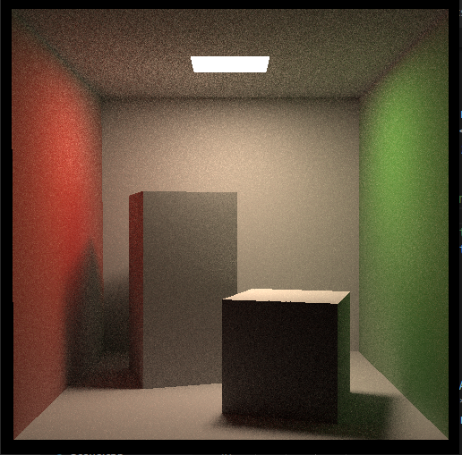

# a Biderectional Renderer that illustrates the Cornell Box

As titled, global illumination.

Read documentation.pdf for related theory. The doco also contains complexity analise based around the Russian Roulette coefficient, and the light ray count per pixel.

The program also implements a super sampling anti-aliasing feature, which is eaily extended from the nature of multiple lights per pixel in BRDF.

Preview Image:

